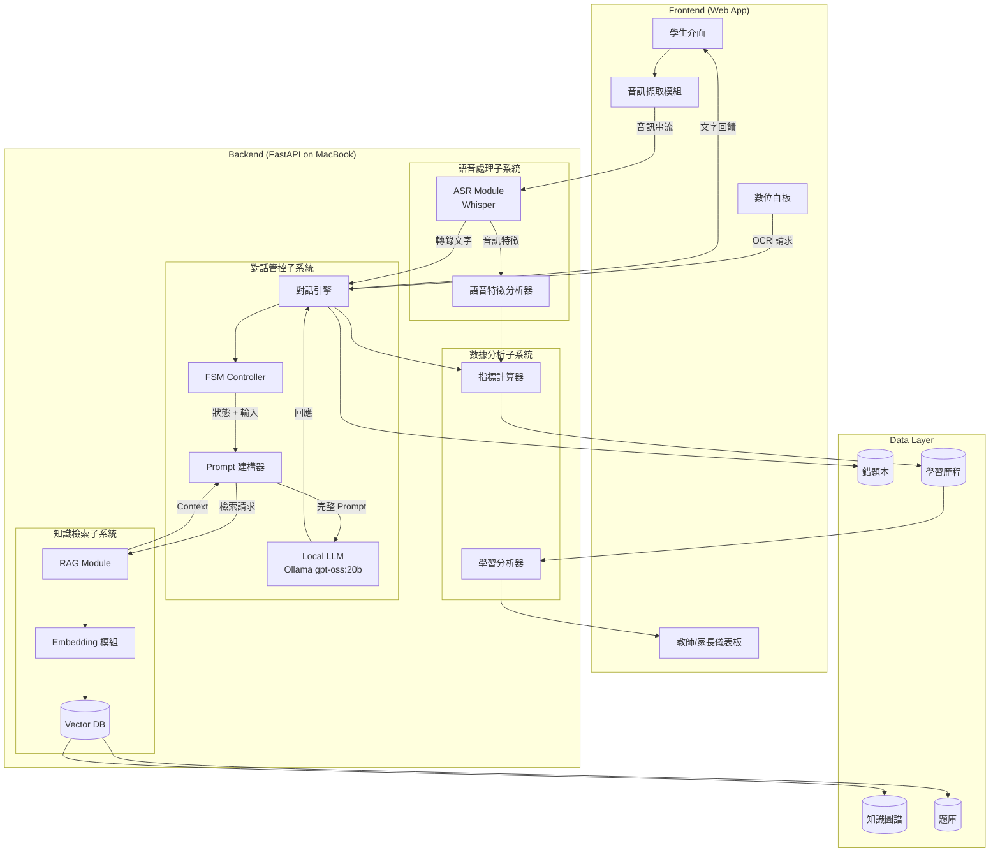

# Design Document: AI 數學語音助教系統

## Overview

本系統採用 Client-Server 架構，Server 端部署於本地 MacBook。核心設計理念是透過有限狀態機 (FSM) 控制對話流程，結合本地 LLM (Ollama) 與 RAG 技術生成教學引導，並透過 ASR (Whisper) 實現語音互動。

系統分為四大子系統：
1. **語音處理子系統**：負責 ASR 轉錄與語音特徵分析
2. **對話管控子系統**：FSM 狀態機與 LLM 回應生成
3. **知識檢索子系統**：RAG 模組與知識圖譜/題庫管理
4. **數據分析子系統**：學習指標計算與儀表板視覺化

## Architecture



## Components and Interfaces

### 1. ASR Module (語音辨識模組)

```typescript
interface ASRModule {
  // 開始串流轉錄
  startStreaming(audioStream: AudioStream): TranscriptionStream;
  
  // 停止轉錄
  stopStreaming(): void;
  
  // 數學符號後處理
  postProcessMathSymbols(text: string): string;
  
  // 取得轉錄信心度
  getConfidence(): number;
}

interface TranscriptionStream {
  onPartialResult(callback: (text: string) => void): void;
  onFinalResult(callback: (result: TranscriptionResult) => void): void;
  onError(callback: (error: Error) => void): void;
}

interface TranscriptionResult {
  text: string;
  confidence: number;
  timestamps: WordTimestamp[];
  duration: number;
}

interface WordTimestamp {
  word: string;
  startTime: number;
  endTime: number;
}
```

### 2. FSM Controller (有限狀態機控制器)

```typescript
enum FSMState {
  IDLE = 'IDLE',
  LISTENING = 'LISTENING',
  ANALYZING = 'ANALYZING',
  PROBING = 'PROBING',
  HINTING = 'HINTING',
  REPAIR = 'REPAIR',
  CONSOLIDATING = 'CONSOLIDATING'
}

interface FSMTransition {
  from: FSMState;
  to: FSMState;
  condition: TransitionCondition;
  action?: () => void;
}

interface TransitionCondition {
  type: 'SILENCE_TIMEOUT' | 'LOGIC_GAP' | 'LOGIC_ERROR' | 'COVERAGE_THRESHOLD' | 'USER_REQUEST' | 'ANALYSIS_COMPLETE';
  params?: Record<string, any>;
}

interface FSMController {
  // 取得當前狀態
  getCurrentState(): FSMState;
  
  // 處理輸入事件
  processEvent(event: FSMEvent): FSMState;
  
  // 註冊狀態變更回調
  onStateChange(callback: (from: FSMState, to: FSMState) => void): void;
  
  // 重置狀態機
  reset(): void;
  
  // 取得狀態歷史
  getStateHistory(): StateTransitionLog[];
}

interface FSMEvent {
  type: 'STUDENT_INPUT' | 'SILENCE_DETECTED' | 'HINT_REQUEST' | 'ANALYSIS_RESULT';
  payload: any;
  timestamp: number;
}

interface StateTransitionLog {
  from: FSMState;
  to: FSMState;
  trigger: FSMEvent;
  timestamp: number;
}
```

### 3. Dialog Engine (對話引擎)

```typescript
interface DialogEngine {
  // 處理學生輸入
  processStudentInput(input: StudentInput): Promise<TutorResponse>;
  
  // 開始新的講題會話
  startSession(questionId: string, studentId: string): Session;
  
  // 結束會話並生成總結
  endSession(sessionId: string): SessionSummary;
  
  // 取得當前會話狀態
  getSessionState(sessionId: string): SessionState;
}

interface StudentInput {
  sessionId: string;
  text: string;
  audioFeatures?: AudioFeatures;
  timestamp: number;
}

interface TutorResponse {
  text: string;
  responseType: 'PROBE' | 'HINT' | 'REPAIR' | 'CONSOLIDATE' | 'ACKNOWLEDGE';
  hintLevel?: HintLevel;
  relatedConcepts?: string[];
  suggestedNextStep?: string;
}

enum HintLevel {
  LEVEL_1 = 1,  // 方向性暗示
  LEVEL_2 = 2,  // 關鍵步驟提示
  LEVEL_3 = 3   // 具體解法框架
}

interface Session {
  id: string;
  questionId: string;
  studentId: string;
  startTime: number;
  fsmState: FSMState;
  conversationHistory: ConversationTurn[];
}

interface SessionSummary {
  sessionId: string;
  duration: number;
  conceptsCovered: string[];
  conceptCoverage: number;
  hintsUsed: HintUsage[];
  metrics: SessionMetrics;
}
```

### 4. RAG Module (檢索增強生成模組)

```typescript
interface RAGModule {
  // 檢索相關內容
  retrieve(query: string, context: RetrievalContext): Promise<RetrievalResult>;
  
  // 索引新內容
  index(content: IndexableContent): Promise<void>;
  
  // 更新向量索引
  updateIndex(): Promise<void>;
}

interface RetrievalContext {
  questionId?: string;
  knowledgeNodes?: string[];
  maxResults?: number;
  minSimilarity?: number;
}

interface RetrievalResult {
  documents: RetrievedDocument[];
  totalFound: number;
}

interface RetrievedDocument {
  id: string;
  content: string;
  type: 'SOLUTION' | 'MISCONCEPTION' | 'HINT' | 'CONCEPT';
  similarity: number;
  metadata: Record<string, any>;
}

interface IndexableContent {
  id: string;
  content: string;
  type: string;
  embedding?: number[];
  metadata: Record<string, any>;
}
```

### 5. Metrics Calculator (指標計算器)

```typescript
interface MetricsCalculator {
  // 計算 WPM
  calculateWPM(wordCount: number, durationMinutes: number): number;
  
  // 計算停頓比例
  calculatePauseRate(pauses: Pause[], totalDuration: number): number;
  
  // 計算提示依賴度
  calculateHintDependency(hints: HintUsage[], totalTurns: number): number;
  
  // 計算概念覆蓋率
  calculateConceptCoverage(coveredConcepts: string[], requiredConcepts: string[]): number;
  
  // 生成完整指標報告
  generateMetricsReport(session: Session): MetricsReport;
}

interface Pause {
  startTime: number;
  endTime: number;
  duration: number;
}

interface HintUsage {
  timestamp: number;
  level: HintLevel;
  concept: string;
}

interface MetricsReport {
  wpm: number;
  pauseRate: number;
  hintDependency: number;
  conceptCoverage: number;
  focusDuration: number;
  distractionPeriods: TimePeriod[];
}
```

### 6. Knowledge Graph Manager (知識圖譜管理器)

```typescript
interface KnowledgeGraphManager {
  // 取得知識節點
  getNode(nodeId: string): KnowledgeNode;
  
  // 取得相關節點
  getRelatedNodes(nodeId: string, relationTypes?: string[]): KnowledgeNode[];
  
  // 新增節點
  addNode(node: KnowledgeNode): void;
  
  // 新增關聯
  addRelation(relation: KnowledgeRelation): void;
  
  // 查詢路徑
  findPath(fromId: string, toId: string): KnowledgePath;
}

interface KnowledgeNode {
  id: string;
  name: string;
  subject: string;
  unit: string;
  difficulty: DifficultyLevel;
  description: string;
  prerequisites: string[];
}

interface KnowledgeRelation {
  fromId: string;
  toId: string;
  type: 'PREREQUISITE' | 'RELATED' | 'EXTENDS' | 'SIMILAR';
  weight: number;
}

enum DifficultyLevel {
  EASY = 1,
  MEDIUM = 2,
  HARD = 3
}
```

### 7. Question Bank Manager (題庫管理器)

```typescript
interface QuestionBankManager {
  // 篩選題目
  filterQuestions(criteria: QuestionCriteria): Question[];
  
  // 取得題目詳情
  getQuestion(questionId: string): Question;
  
  // 取得相似題
  getSimilarQuestions(questionId: string, count: number): Question[];
  
  // 批次匯入題目
  importQuestions(questions: QuestionImport[], format: 'JSON' | 'CSV'): ImportResult;
  
  // 驗證答案
  validateAnswer(questionId: string, answer: string): AnswerValidation;
}

interface Question {
  id: string;
  content: string;
  type: 'MULTIPLE_CHOICE' | 'FILL_BLANK' | 'CALCULATION' | 'PROOF';
  subject: string;
  unit: string;
  difficulty: DifficultyLevel;
  knowledgeNodes: string[];
  standardSolution: string;
  commonMisconceptions: Misconception[];
  hints: HintContent[];
}

interface QuestionCriteria {
  subject?: string;
  unit?: string;
  difficulty?: DifficultyLevel;
  knowledgeNodes?: string[];
  excludeIds?: string[];
}

interface Misconception {
  id: string;
  description: string;
  errorType: 'CALCULATION' | 'CONCEPT' | 'CARELESS';
  correction: string;
}

interface HintContent {
  level: HintLevel;
  content: string;
}
```

### 8. Error Book Manager (錯題本管理器)

```typescript
interface ErrorBookManager {
  // 新增錯題
  addError(error: ErrorRecord): void;
  
  // 取得錯題列表
  getErrors(studentId: string, criteria?: ErrorCriteria): ErrorRecord[];
  
  // 標記錯題為已修復
  markAsRepaired(errorId: string): void;
  
  // 取得錯題統計
  getErrorStatistics(studentId: string): ErrorStatistics;
}

interface ErrorRecord {
  id: string;
  studentId: string;
  questionId: string;
  studentAnswer: string;
  correctAnswer: string;
  errorType: 'CALCULATION' | 'CONCEPT' | 'CARELESS';
  errorTags: string[];
  timestamp: number;
  repaired: boolean;
  repairedAt?: number;
}

interface ErrorCriteria {
  errorType?: string;
  tags?: string[];
  unit?: string;
  dateRange?: DateRange;
  repairedStatus?: boolean;
}

interface ErrorStatistics {
  totalErrors: number;
  repairedCount: number;
  errorsByType: Record<string, number>;
  errorsByUnit: Record<string, number>;
  mostFrequentMisconceptions: string[];
}
```

## Data Models

### Database Schema (SQLite/PostgreSQL)

```sql
-- 學生資料表
CREATE TABLE students (
    id TEXT PRIMARY KEY,
    name TEXT NOT NULL,
    grade INTEGER NOT NULL,
    created_at TIMESTAMP DEFAULT CURRENT_TIMESTAMP
);

-- 題目資料表
CREATE TABLE questions (
    id TEXT PRIMARY KEY,
    content TEXT NOT NULL,
    type TEXT NOT NULL,
    subject TEXT NOT NULL,
    unit TEXT NOT NULL,
    difficulty INTEGER NOT NULL,
    standard_solution TEXT NOT NULL,
    created_at TIMESTAMP DEFAULT CURRENT_TIMESTAMP
);

-- 題目知識點關聯表
CREATE TABLE question_knowledge_nodes (
    question_id TEXT REFERENCES questions(id),
    node_id TEXT REFERENCES knowledge_nodes(id),
    PRIMARY KEY (question_id, node_id)
);

-- 知識圖譜節點表
CREATE TABLE knowledge_nodes (
    id TEXT PRIMARY KEY,
    name TEXT NOT NULL,
    subject TEXT NOT NULL,
    unit TEXT NOT NULL,
    difficulty INTEGER NOT NULL,
    description TEXT,
    created_at TIMESTAMP DEFAULT CURRENT_TIMESTAMP
);

-- 知識圖譜關聯表
CREATE TABLE knowledge_relations (
    from_id TEXT REFERENCES knowledge_nodes(id),
    to_id TEXT REFERENCES knowledge_nodes(id),
    relation_type TEXT NOT NULL,
    weight REAL DEFAULT 1.0,
    PRIMARY KEY (from_id, to_id, relation_type)
);

-- 常見迷思概念表
CREATE TABLE misconceptions (
    id TEXT PRIMARY KEY,
    question_id TEXT REFERENCES questions(id),
    description TEXT NOT NULL,
    error_type TEXT NOT NULL,
    correction TEXT NOT NULL
);

-- 提示內容表
CREATE TABLE hints (
    id TEXT PRIMARY KEY,
    question_id TEXT REFERENCES questions(id),
    level INTEGER NOT NULL,
    content TEXT NOT NULL
);

-- 學習會話表
CREATE TABLE sessions (
    id TEXT PRIMARY KEY,
    student_id TEXT REFERENCES students(id),
    question_id TEXT REFERENCES questions(id),
    start_time TIMESTAMP NOT NULL,
    end_time TIMESTAMP,
    final_state TEXT,
    concept_coverage REAL
);

-- 對話紀錄表
CREATE TABLE conversation_turns (
    id TEXT PRIMARY KEY,
    session_id TEXT REFERENCES sessions(id),
    turn_number INTEGER NOT NULL,
    speaker TEXT NOT NULL, -- 'STUDENT' or 'TUTOR'
    content TEXT NOT NULL,
    fsm_state TEXT NOT NULL,
    timestamp TIMESTAMP NOT NULL
);

-- 學習指標表
CREATE TABLE learning_metrics (
    id TEXT PRIMARY KEY,
    session_id TEXT REFERENCES sessions(id),
    wpm REAL,
    pause_rate REAL,
    hint_dependency REAL,
    concept_coverage REAL,
    focus_duration REAL,
    created_at TIMESTAMP DEFAULT CURRENT_TIMESTAMP
);

-- 停頓紀錄表
CREATE TABLE pauses (
    id TEXT PRIMARY KEY,
    session_id TEXT REFERENCES sessions(id),
    start_time REAL NOT NULL,
    end_time REAL NOT NULL,
    duration REAL NOT NULL
);

-- 提示使用紀錄表
CREATE TABLE hint_usages (
    id TEXT PRIMARY KEY,
    session_id TEXT REFERENCES sessions(id),
    hint_level INTEGER NOT NULL,
    concept TEXT,
    timestamp TIMESTAMP NOT NULL
);

-- 錯題本表
CREATE TABLE error_records (
    id TEXT PRIMARY KEY,
    student_id TEXT REFERENCES students(id),
    question_id TEXT REFERENCES questions(id),
    student_answer TEXT NOT NULL,
    correct_answer TEXT NOT NULL,
    error_type TEXT NOT NULL,
    error_tags TEXT, -- JSON array
    timestamp TIMESTAMP NOT NULL,
    repaired BOOLEAN DEFAULT FALSE,
    repaired_at TIMESTAMP
);

-- 向量索引表 (用於 RAG)
CREATE TABLE embeddings (
    id TEXT PRIMARY KEY,
    content_id TEXT NOT NULL,
    content_type TEXT NOT NULL,
    embedding BLOB NOT NULL, -- 儲存向量
    created_at TIMESTAMP DEFAULT CURRENT_TIMESTAMP
);
```

### Vector Database Schema (for RAG)

```typescript
interface VectorDocument {
  id: string;
  contentId: string;
  contentType: 'QUESTION' | 'SOLUTION' | 'MISCONCEPTION' | 'CONCEPT';
  text: string;
  embedding: number[];  // 768 or 1536 dimensions
  metadata: {
    questionId?: string;
    nodeId?: string;
    difficulty?: number;
    subject?: string;
    unit?: string;
  };
}
```

## Correctness Properties

*A property is a characteristic or behavior that should hold true across all valid executions of a system—essentially, a formal statement about what the system should do. Properties serve as the bridge between human-readable specifications and machine-verifiable correctness guarantees.*


### Property 1: 題目篩選結果正確性

*For any* 篩選條件組合 (科目、單元、難度) 和題庫資料，Question_Bank 返回的所有題目都應符合指定的篩選條件。

**Validates: Requirements 1.2**

### Property 2: OCR 低信心度處理

*For any* OCR 辨識結果，若信心度低於設定閾值，系統應標示不確定區域並返回需確認的標記。

**Validates: Requirements 2.3**

### Property 3: 錯誤答案觸發延伸題檢索

*For any* 錯誤答案提交，RAG_Module 應返回 1-2 題與原題目相同知識點的延伸題。

**Validates: Requirements 3.2**

### Property 4: 錯題歸檔完整性

*For any* 學生答錯的題目，Error_Book 應儲存完整的錯題記錄 (題目 ID、學生答案、正確答案、錯誤類型標籤)，且查詢該錯題應返回相同資料。

**Validates: Requirements 4.1, 4.2**

### Property 5: 錯題篩選正確性

*For any* 錯題篩選條件 (標籤、日期、單元)，Error_Book 返回的所有錯題都應符合指定的篩選條件。

**Validates: Requirements 4.3**

### Property 6: 數學符號轉換正確性

*For any* 包含數學口語描述的文字 (如「X 平方」、「根號 2」)，ASR_Module 的後處理應將其轉換為對應的標準數學符號 (如「x²」、「√2」)，且轉換後再轉回口語描述應等價於原始描述。

**Validates: Requirements 5.3**

### Property 7: FSM 狀態轉移正確性

*For any* FSM 事件序列，狀態轉移應遵循以下規則：
- 靜默超時 → 轉移至 HINTING
- 邏輯缺漏 → 轉移至 PROBING
- 邏輯謬誤 → 轉移至 REPAIR
- 概念覆蓋率 ≥ 90% → 轉移至 CONSOLIDATING

**Validates: Requirements 6.3, 6.4, 6.7, 6.8**

### Property 8: 提示層級遞增正確性

*For any* 連續的提示請求序列，提示層級應從 Level 1 開始，每次請求遞增一級，最高至 Level 3，且每次提示都應被記錄。

**Validates: Requirements 7.1, 7.2, 7.3, 7.4**

### Property 9: 錯題修復流程正確性

*For any* 通過變題測試的錯題，該錯題在 Error_Book 中的狀態應被標記為「已修復」。

**Validates: Requirements 8.3**

### Property 10: 學習指標計算正確性

*For any* 口語講題會話資料 (字數、時長、停頓、提示使用)，Learning_Metrics 計算的指標應符合以下公式：
- WPM = 總字數 / 發話時間(分鐘)
- 停頓比例 = 停頓總時長 / 總時長
- 提示依賴度 = 1 - Σ(提示次數 × 權重) / 總互動輪數

**Validates: Requirements 9.1, 9.3, 9.4**

### Property 11: 學習指標持久化完整性

*For any* 計算完成的學習指標，儲存至資料庫後查詢應返回相同的指標值。

**Validates: Requirements 9.5**

### Property 12: 弱點熱力圖資料正確性

*For any* 學生的學習歷程資料，Dashboard 的弱點熱力圖應正確反映各知識點的掌握度 (基於錯題率和概念覆蓋率)。

**Validates: Requirements 10.2**

### Property 13: RAG 檢索先於 LLM 生成

*For any* 需要 LLM 生成回應的請求，RAG 檢索應在 LLM 呼叫之前完成，且檢索結果應被注入 Prompt。

**Validates: Requirements 11.1, 11.2**

### Property 14: 知識圖譜模組化擴充

*For any* 新增的科目或單元節點，Knowledge_Graph 應能正確儲存並建立與現有節點的關聯。

**Validates: Requirements 13.1**

### Property 15: 題庫匯入匯出 Round-Trip

*For any* 有效的題目資料 (JSON/CSV 格式)，匯入後再匯出應產生等價的資料結構。

**Validates: Requirements 13.2**

### Property 16: 題目知識點自動關聯

*For any* 新增的題目，系統應自動將其關聯至對應的知識圖譜節點，且關聯關係應可查詢。

**Validates: Requirements 13.3**

### Property 17: 知識圖譜匯出備份 Round-Trip

*For any* 知識圖譜資料，匯出備份後再匯入應還原完整的節點與關聯結構。

**Validates: Requirements 13.4**

## Error Handling

### 1. ASR 錯誤處理

| 錯誤情境 | 處理策略 |
|---------|---------|
| 音訊串流中斷 | 自動重連，保留已轉錄內容，提示使用者重新開始 |
| 辨識信心度過低 | 標示不確定區域，允許手動修正或語音重說 |
| 數學符號辨識失敗 | 回退至原始文字，提供手動輸入選項 |
| 麥克風權限被拒 | 顯示權限請求說明，引導使用者開啟權限 |

### 2. LLM 錯誤處理

| 錯誤情境 | 處理策略 |
|---------|---------|
| Ollama 服務未啟動 | 顯示啟動指引，提供一鍵啟動按鈕 |
| 模型載入失敗 | 檢查記憶體，建議降級模型或關閉其他應用 |
| 生成超時 (>10s) | 中斷生成，返回預設回應，記錄異常 |
| 幻覺風險偵測 | 若回應與 RAG 檢索內容差異過大，返回「無法判斷」 |

### 3. RAG 錯誤處理

| 錯誤情境 | 處理策略 |
|---------|---------|
| 向量資料庫連線失敗 | 使用快取結果，記錄異常，背景重連 |
| 檢索結果為空 | 擴大檢索範圍，降低相似度閾值 |
| Embedding 生成失敗 | 使用備用 Embedding 模型或關鍵字檢索 |

### 4. FSM 錯誤處理

| 錯誤情境 | 處理策略 |
|---------|---------|
| 無效狀態轉移 | 記錄異常，保持當前狀態，通知開發者 |
| 狀態卡死 (長時間無轉移) | 自動轉移至 IDLE，提示使用者重新開始 |
| 會話資料遺失 | 從最近檢查點恢復，或重新開始會話 |

### 5. 資料庫錯誤處理

| 錯誤情境 | 處理策略 |
|---------|---------|
| 寫入失敗 | 重試 3 次，失敗後暫存至本地快取 |
| 查詢超時 | 返回快取結果，背景重新查詢 |
| 資料完整性錯誤 | 記錄異常，觸發資料修復流程 |

## Testing Strategy

### 測試框架選擇

- **單元測試**: pytest (Python backend)
- **Property-Based Testing**: Hypothesis (Python)
- **前端測試**: Jest + React Testing Library
- **E2E 測試**: Playwright

### 單元測試策略

單元測試聚焦於：
- 特定範例的正確行為驗證
- 邊界條件與錯誤處理
- 元件間整合點

```python
# 範例：WPM 計算單元測試
def test_wpm_calculation_basic():
    """測試基本 WPM 計算"""
    calculator = MetricsCalculator()
    wpm = calculator.calculate_wpm(word_count=150, duration_minutes=2.0)
    assert wpm == 75.0

def test_wpm_calculation_zero_duration():
    """測試零時長邊界情況"""
    calculator = MetricsCalculator()
    with pytest.raises(ValueError):
        calculator.calculate_wpm(word_count=100, duration_minutes=0)
```

### Property-Based Testing 策略

每個正確性屬性對應一個 property test，最少執行 100 次迭代。

```python
from hypothesis import given, strategies as st, settings

# Property 1: 題目篩選結果正確性
@settings(max_examples=100)
@given(
    subject=st.sampled_from(['數學', '代數', '幾何']),
    unit=st.text(min_size=1, max_size=20),
    difficulty=st.integers(min_value=1, max_value=3),
    questions=st.lists(st.builds(Question), min_size=0, max_size=50)
)
def test_question_filter_correctness(subject, unit, difficulty, questions):
    """
    Feature: ai-math-tutor, Property 1: 題目篩選結果正確性
    Validates: Requirements 1.2
    """
    bank = QuestionBank(questions)
    criteria = QuestionCriteria(subject=subject, unit=unit, difficulty=difficulty)
    results = bank.filter_questions(criteria)
    
    for question in results:
        assert question.subject == subject
        assert question.unit == unit
        assert question.difficulty == difficulty

# Property 7: FSM 狀態轉移正確性
@settings(max_examples=100)
@given(events=st.lists(st.builds(FSMEvent), min_size=1, max_size=20))
def test_fsm_state_transitions(events):
    """
    Feature: ai-math-tutor, Property 7: FSM 狀態轉移正確性
    Validates: Requirements 6.3, 6.4, 6.7, 6.8
    """
    fsm = FSMController()
    
    for event in events:
        prev_state = fsm.get_current_state()
        new_state = fsm.process_event(event)
        
        # 驗證狀態轉移規則
        if event.type == 'SILENCE_DETECTED' and event.payload['duration'] > SILENCE_THRESHOLD:
            assert new_state == FSMState.HINTING
        elif event.type == 'ANALYSIS_RESULT' and event.payload.get('logic_gap'):
            assert new_state == FSMState.PROBING
        elif event.type == 'ANALYSIS_RESULT' and event.payload.get('logic_error'):
            assert new_state == FSMState.REPAIR
        elif event.type == 'ANALYSIS_RESULT' and event.payload.get('coverage', 0) >= 0.9:
            assert new_state == FSMState.CONSOLIDATING

# Property 10: 學習指標計算正確性
@settings(max_examples=100)
@given(
    word_count=st.integers(min_value=1, max_value=10000),
    duration_minutes=st.floats(min_value=0.1, max_value=60.0),
    pauses=st.lists(st.builds(Pause), min_size=0, max_size=50),
    hints=st.lists(st.builds(HintUsage), min_size=0, max_size=10),
    total_turns=st.integers(min_value=1, max_value=100)
)
def test_learning_metrics_calculation(word_count, duration_minutes, pauses, hints, total_turns):
    """
    Feature: ai-math-tutor, Property 10: 學習指標計算正確性
    Validates: Requirements 9.1, 9.3, 9.4
    """
    calculator = MetricsCalculator()
    
    # WPM 計算
    wpm = calculator.calculate_wpm(word_count, duration_minutes)
    assert abs(wpm - (word_count / duration_minutes)) < 0.001
    
    # 停頓比例計算
    total_duration = duration_minutes * 60  # 轉換為秒
    pause_rate = calculator.calculate_pause_rate(pauses, total_duration)
    expected_pause_rate = sum(p.duration for p in pauses) / total_duration if total_duration > 0 else 0
    assert abs(pause_rate - expected_pause_rate) < 0.001
    
    # 提示依賴度計算
    hint_dependency = calculator.calculate_hint_dependency(hints, total_turns)
    weighted_hints = sum(h.level for h in hints)  # 假設權重 = level
    expected_dependency = 1 - (weighted_hints / total_turns) if total_turns > 0 else 1
    assert abs(hint_dependency - expected_dependency) < 0.001

# Property 15: 題庫匯入匯出 Round-Trip
@settings(max_examples=100)
@given(questions=st.lists(st.builds(Question), min_size=1, max_size=20))
def test_question_bank_round_trip(questions):
    """
    Feature: ai-math-tutor, Property 15: 題庫匯入匯出 Round-Trip
    Validates: Requirements 13.2
    """
    bank = QuestionBankManager()
    
    # 匯出為 JSON
    exported_json = bank.export_questions(questions, format='JSON')
    
    # 重新匯入
    imported_questions = bank.import_questions(exported_json, format='JSON')
    
    # 驗證 round-trip
    assert len(imported_questions) == len(questions)
    for orig, imported in zip(questions, imported_questions):
        assert orig.id == imported.id
        assert orig.content == imported.content
        assert orig.subject == imported.subject
        assert orig.unit == imported.unit
        assert orig.difficulty == imported.difficulty
```

### 測試覆蓋率目標

| 測試類型 | 覆蓋率目標 |
|---------|-----------|
| 單元測試 | ≥ 80% |
| Property Tests | 所有 17 個正確性屬性 |
| 整合測試 | 關鍵流程 100% |
| E2E 測試 | 主要使用者旅程 |

### 測試執行配置

```yaml
# pytest.ini
[pytest]
minversion = 7.0
addopts = -ra -q --hypothesis-show-statistics
testpaths = tests
python_files = test_*.py
python_functions = test_*

# Hypothesis 設定
[hypothesis]
max_examples = 100
deadline = 5000  # 5 秒超時
```
